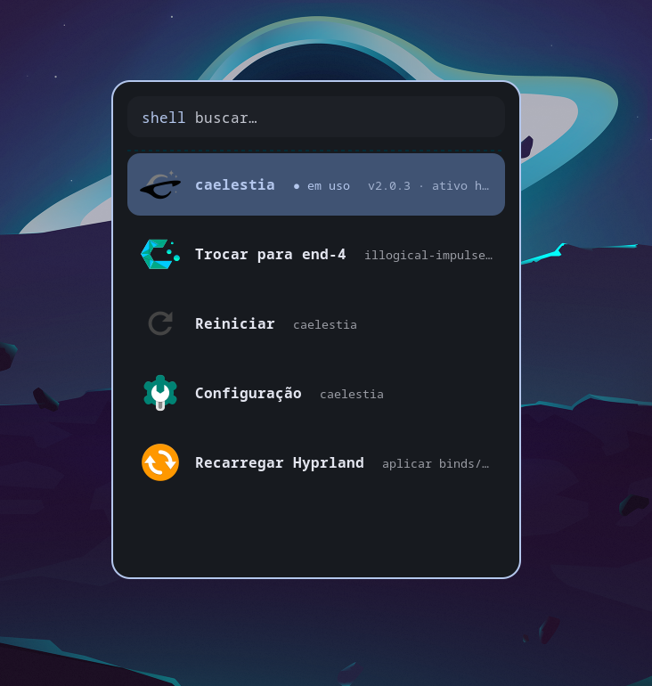

<div align="center">

# hypr-shell-switcher

Alterne entre múltiplos shells [Quickshell](https://quickshell.outfoxxed.me) no [Hyprland](https://hyprland.org) sem logout, com keybinds próprios por shell, troca animada e um menu temático.

[](https://hyprland.org)
[](https://quickshell.outfoxxed.me)
[](#)
[](https://github.com/davatorium/rofi)
[](LICENSE)



</div>

## Sobre

Roda dois (ou mais) shells Quickshell na mesma sessão do Hyprland e troca entre eles a quente. Vem pronto para os dois shells mais populares:

- **[end-4](https://github.com/end-4/dots-hyprland)** (`illogical-impulse`) — `~/.config/quickshell/ii`
- **[caelestia](https://github.com/caelestia-dots/shell)** (`caelestia-shell`) — `~/.config/quickshell/caelestia`

Cada shell expõe seus próprios globals e atalhos. Este projeto resolve isso carregando keybinds específicos por shell de forma condicional, então cada um funciona como se fosse o único instalado.

## Recursos

- **Troca a quente** entre shells, sem encerrar a sessão
- **Transição animada** — congela a tela (`grim`) e revela o novo shell com `swww`
- **Menu temático** (`rofi`) que herda as cores Material You do shell ativo
- **Keybinds por shell** — overrides condicionais para o caelestia (screenshot, launcher, sidebar, sessão, mídia, clipboard)
- **Auto-detecção** — qualquer pasta em `~/.config/quickshell/<nome>/shell.qml` aparece no menu
- **Indicadores ricos** — versão e status (ativo/parado, há quanto tempo) de cada shell
- **Toggle direto** ou **menu completo** (trocar / reiniciar / configurar / recarregar)

## Requisitos

| Pacote | Uso |
|---|---|
| `quickshell` | os shells em si |
| `hyprland` | window manager |
| `rofi` (wayland) | menu de seleção |
| `swww` + `grim` | animação de troca |
| `python3` | extração das cores do tema |
| `app2unit` | lançar o shell via systemd (opcional) |
| `papirus-icon-theme` | ícones das ações do menu |

## Instalação

```sh
git clone https://github.com/kellyson71/hypr-shell-switcher
cd hypr-shell-switcher
./install.sh
```

O instalador copia os arquivos para `~/.config/hypr`, registra o bloco condicional no `hyprland.conf` e cria o `active-profile.conf` inicial. Em seguida, adicione os atalhos ao seu `keybinds.conf`:

```ini
bind = Super+Control, Tab, exec, ~/.config/hypr/scripts/switch-shell.sh toggle
bind = Super+Control+Shift, Tab, exec, ~/.config/hypr/scripts/switch-shell.sh menu
```

## Uso

| Atalho | Ação |
|---|---|
| `Super+Control+Tab` | alterna direto para o próximo shell |
| `Super+Control+Shift+Tab` | abre o menu completo |

Ou pela linha de comando:

```sh
switch-shell.sh toggle       # próximo shell
switch-shell.sh caelestia    # troca direto
switch-shell.sh end4         # troca direto
switch-shell.sh menu         # menu rofi
```

## Como funciona

```
~/.config/hypr/
├── hyprland.conf              # source de active-profile.conf + bloco condicional
├── active-profile.conf        # perfil ativo (cópia de profiles/<shell>.conf)
├── caelestia-overrides.conf   # keybinds do caelestia (carregado se isCaelestia)
├── profiles/
│   ├── end4.conf              # $qsConfig = ii   ; $isCaelestia =
│   └── caelestia.conf         # $qsConfig = caelestia ; $isCaelestia = 1
└── scripts/
    ├── switch-shell.sh        # troca, menu e animação
    └── shell-colors.py        # extrai as cores Material You do shell ativo
```

Cada perfil define a variável `$qsConfig` (qual pasta do Quickshell carregar) e a flag `$isCaelestia`. O `hyprland.conf` faz `source` do `active-profile.conf` no início e, no fim, carrega os overrides do caelestia apenas quando a flag está ativa:

```ini
source = active-profile.conf

# hyprlang if isCaelestia
source = caelestia-overrides.conf
# hyprlang endif
```

Trocar de shell é: copiar o perfil para `active-profile.conf`, recarregar o Hyprland e reiniciar o `qs` com o novo `qsConfig`.

## Créditos

- [end-4/dots-hyprland](https://github.com/end-4/dots-hyprland)
- [caelestia-dots/shell](https://github.com/caelestia-dots/shell)
- [Quickshell](https://quickshell.outfoxxed.me) por [outfoxxed](https://git.outfoxxed.me)

## Licença

[MIT](LICENSE)
