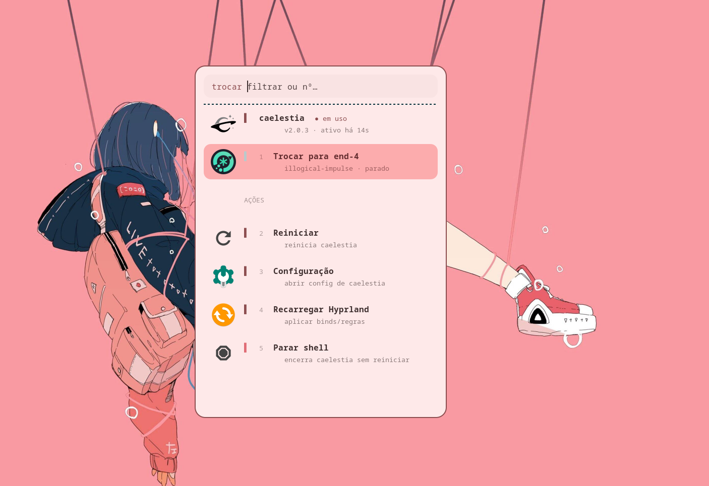

<div align="center">

# hypr-shell-switcher

Switch between multiple [Quickshell](https://quickshell.outfoxxed.me) shells on [Hyprland](https://hyprland.org) without logging out — with a flicker-free animated transition, a themed rofi menu and per-shell keybinds.

[](https://hyprland.org)
[](https://quickshell.outfoxxed.me)
[](#)
[](https://github.com/davatorium/rofi)
[](LICENSE)

<br>


<br>



</div>

## About

Runs two (or more) Quickshell shells in the same Hyprland session and lets you switch between them on the fly — no logout, no black flash, no bar popping.

Ships pre-configured for the two most popular community shells:

- **[end-4 / illogical-impulse](https://github.com/end-4/dots-hyprland)** — `~/.config/quickshell/ii`
- **[caelestia-shell](https://github.com/caelestia-dots/shell)** — `~/.config/quickshell/caelestia`

Adding any other Quickshell-based shell takes about five minutes — see [Adding a new shell](#adding-a-new-shell).

## Features

- **Flicker-free transition** — freezes the current frame on the Wayland overlay layer (above everything) while the new shell loads in the background; fades out only when it's fully ready, so there's no black gap or bars popping in
- **Logo crossfade** — a card in the corner smoothly crossfades from the outgoing shell's logo to the incoming one's during the transition
- **Themed menu** — rofi inherits the active shell's Material You colors; two-line rows with per-shell accent bars, numbered entries, `Ctrl+j/k` vim-style navigation
- **Rich status** — the active shell sits at the top with its logo, version and uptime; each entry shows description and running/stopped status
- **Per-shell keybinds** — conditional Hyprland overrides load and unload with the active shell; ships with a full caelestia override set (screenshot, launcher, sidebar, session, media, clipboard)
- **Auto-detection** — any `~/.config/quickshell/<name>/shell.qml` is picked up automatically
- **Actions per shell** — switch, restart, configure (opens the shell's config folder), reload Hyprland, stop
- **Graceful fallback** — if `ags` or `grim` is missing the switch still works, just without the overlay animation

## Requirements

| Package | Purpose |
|---|---|
| `quickshell` | the shells themselves |
| `hyprland` | compositor (≥ 0.41 for `hyprlang if`) |
| `rofi` (wayland build) | selection menu |
| `grim` | screenshot used as the freeze frame |
| `ags` (aylurs-gtk-shell ≥ 3) | renders the transition overlay |
| `python3` | extracts Material You colors from each shell's state file |
| `app2unit` | launch the shell under systemd (optional but recommended) |
| `papirus-icon-theme` | icons for menu actions |

## Installation

```sh
git clone https://github.com/kellyson71/hypr-shell-switcher
cd hypr-shell-switcher
./install.sh
```

The installer copies everything to `~/.config/hypr`, registers the conditional source block in `hyprland.conf` and creates the initial `active-profile.conf`. Then add your keybinds:

```ini
# keybinds.conf
bind = Super+Control, Tab, exec, ~/.config/hypr/scripts/switch-shell.sh toggle
bind = Super+Control+Shift, Tab, exec, ~/.config/hypr/scripts/switch-shell.sh menu
```

## Usage

| Shortcut | Action |
|---|---|
| `Super+Control+Tab` | switch directly to the next shell |
| `Super+Control+Shift+Tab` | open the full menu |

Or from the terminal:

```sh
switch-shell.sh toggle       # cycle to the next shell
switch-shell.sh caelestia    # switch directly by name
switch-shell.sh end4         # switch directly by name
switch-shell.sh menu         # open rofi menu
```

## How it works

```
~/.config/hypr/
├── hyprland.conf              # sources active-profile.conf + conditional block
├── active-profile.conf        # active profile (overwritten on each switch)
├── caelestia-overrides.conf   # caelestia keybinds (sourced only when active)
├── assets/
│   └── illogical-impulse.svg  # end-4 logo for the transition card
├── profiles/
│   ├── end4.conf              # $qsConfig = ii   ; $isCaelestia =
│   └── caelestia.conf         # $qsConfig = caelestia ; $isCaelestia = 1
└── scripts/
    ├── switch-shell.sh        # main script: switching, menu, animation orchestration
    ├── transition.ts          # ags v3 overlay app: frozen frame + logo crossfade
    └── shell-colors.py        # extracts Material You colors from each shell's state
```

Each profile sets `$qsConfig` (the Quickshell config folder to load) and optional flags. `hyprland.conf` sources the active profile at startup and conditionally loads per-shell overrides:

```ini
source = active-profile.conf

# hyprlang if isCaelestia
source = caelestia-overrides.conf
# hyprlang endif
```

**During a switch:**

1. `switch-shell.sh` waits for rofi to fully disappear from Wayland layers (avoiding menu artefacts in the freeze frame)
2. `grim` captures a screenshot of the current screen
3. `transition.ts` is launched via `ags run --gtk 4` as a full-screen overlay on the OVERLAY layer — above the taskbar, above everything — showing the frozen screenshot and a logo crossfade card
4. Hyprland reloads the new profile; `qs` (Quickshell) restarts with the new config
5. `switch-shell.sh` polls `qs ipc show` until the new shell responds, then touches a sentinel file
6. `transition.ts` detects the sentinel, runs a 380 ms easeOutCubic fade-out and quits — revealing the already-loaded shell underneath

The result: from the user's point of view the screen never goes black and no bars appear mid-transition.

## Adding a new shell

1. **Create a profile** at `hypr/profiles/<name>.conf`:

```ini
$qsConfig = <quickshell-folder-name>
```

2. **Register the shell** in `switch-shell.sh` — add an entry to `shell_list()`, `shell_label()`, `shell_icon()` and `shell_desc()`:

```bash
shell_list()  { echo "end4 caelestia yourshell"; }
shell_label() { case $1 in end4) echo "illogical-impulse";; caelestia) echo "caelestia-shell";; yourshell) echo "Your Shell Name";; esac; }
shell_icon()  { case $1 in yourshell) echo "/path/to/icon.svg";; ... esac; }
shell_desc()  { case $1 in yourshell) echo "Short description";; ... esac; }
```

3. **(Optional) Per-shell keybinds** — create `hypr/<name>-overrides.conf` and add the appropriate `hyprlang if` block to `hyprland.conf`.

4. **(Optional) Logo for the transition card** — drop an SVG into `hypr/assets/<name>.svg` and point `shell_icon()` at it.

5. **(Optional) Material You colors** — extend `shell-colors.py` with the path to your shell's generated color scheme JSON.

## Customizing the animation

All animation parameters live in `transition.ts`:

| Variable | Default | Description |
|---|---|---|
| `transitionDuration` in `makeCard()` | `480 ms` | Logo crossfade duration |
| Logo swap delay | `360 ms` | Delay before switching to the "to" logo |
| `dur` in `fadeOut()` | `380 ms` | Fade-out duration |
| `ST_TIMEOUT` env var | `8000 ms` | Maximum wait before forcing fade-out |

The freeze frame is captured by `grim` and displayed full-screen via `Gtk.Picture` with `COVER` fit, so it works on any resolution or multi-monitor setup.

## Credits

- [end-4/dots-hyprland](https://github.com/end-4/dots-hyprland)
- [caelestia-dots/shell](https://github.com/caelestia-dots/shell)
- [Quickshell](https://quickshell.outfoxxed.me) by [outfoxxed](https://git.outfoxxed.me)

## License

[MIT](LICENSE)
